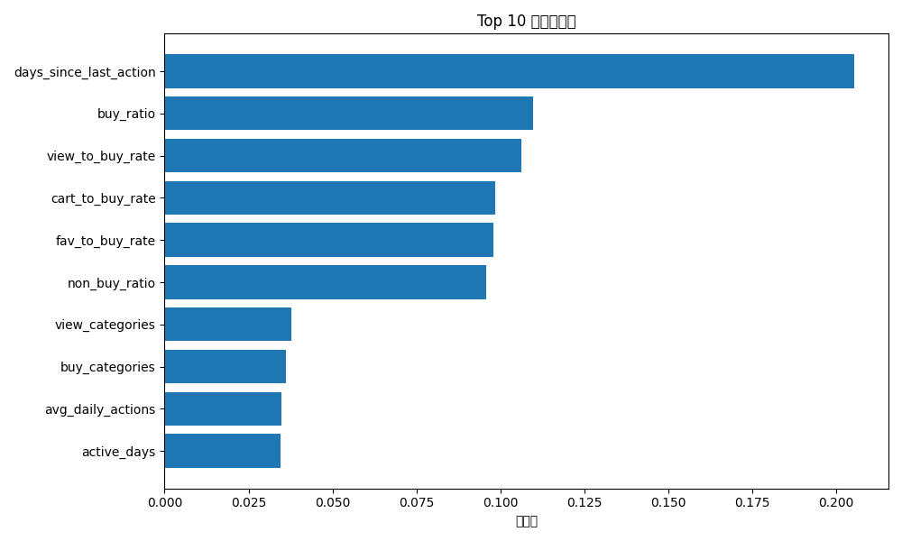

# 淘宝用户次日购买预测项目

## 📌 项目概述
基于天池移动推荐大赛公开数据集（100万+用户行为记录），构建机器学习模型预测用户次日是否有购买行为，AUC达0.882。

## 🔧 技术栈
- Python、Pandas、Scikit-learn、XGBoost、Random Forest
- 特征工程、样本不平衡处理、模型调优

## 📊 数据集
- 来源：天池移动推荐大赛
- 数据范围：2014.11.18 - 2014.12.18
- 包含字段：用户ID、商品ID、行为类型（1浏览/2收藏/3加购/4购买）、时间戳

## 🧠 核心工作

### 1. 特征工程
构造16维特征，包括：
- 用户活跃度：总行为数、活跃天数
- 转化率特征：浏览→购买转化率、加购→购买转化率
- 时间衰减特征：距上次活跃天数
- 商品类目偏好：浏览/购买的类目数

### 2. 模型训练
对比三种算法：
- 逻辑回归：AUC 0.8638
- 随机森林：AUC **0.8821**（最佳）
- XGBoost：AUC 0.8802

### 3. 特征重要性分析


发现“距上次活跃天数”“历史购买占比”是预测次日购买的核心指标。

## 📁 文件说明
- `code/feature_engineering.py`：特征构造代码
- `code/model_training.py`：模型训练与评估代码
- `data/user_features_sample.csv`：特征数据示例
- `results/feature_importance.png`：特征重要性可视化

## 🚀 如何运行
```bash
pip install -r requirements.txt
python code/feature_engineering.py
python code/model_training.py# taobao-buy-prediction
